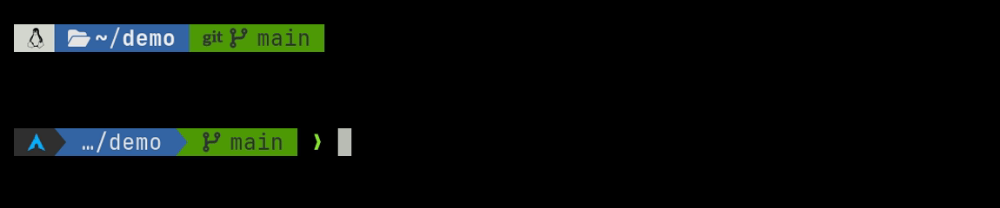
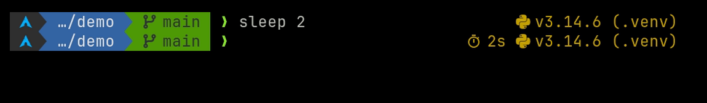

# starship-p10k-rainbow

[](https://github.com/carlosplanchon/starship-p10k-rainbow/actions/workflows/lint.yml)

A [Starship](https://starship.rs) preset that recreates the
[Powerlevel10k](https://github.com/romkatv/powerlevel10k) **"rainbow"** style:
powerline segments, one line, compact. Works in any shell Starship supports;
no zsh framework required.



## Why

Powerlevel10k is zsh-only. If you are moving to another shell, or just away
from prompt frameworks, this preset keeps your muscle memory: same segment
order, same ANSI colors, same compact one-line layout ("flat heads, flat
tails") as p10k's default rainbow profile.

## What you get

**Left side**: OS icon · directory · Git · prompt character:

- **Git branch**, with the remote branch appended only when it differs from
  the local one, and long names truncated at 32 characters.
- **Detached HEAD** shows the short commit hash instead, plus a tag when HEAD
  points exactly at one.
- **Operations in progress**: `REBASE 3/10`, `MERGE`, `CHERRY-PICK`, `BISECT`.
- **Dirty state** in a yellow subsegment (`!2 ?1 ⇡1` …) that collapses
  entirely when the repo is clean and in sync.
- Optional **line metrics** (`+12 -3`): enable by setting
  `git_metrics.disabled = false`.
- `❯` turns red when the last command failed; `❮` in vi command mode.

**Right side**: command duration (over 500 ms) and language versions:
Node.js, Bun, Python (with the active virtualenv name), Rust, Go.

| State | Screenshot |
|---|---|
| Clean repo |  |
| Dirty repo |  |
| Detached HEAD on a tag |  |
| Rebase in progress |  |
| Python virtualenv + duration |  |

## Requirements

- [Starship](https://starship.rs/guide/), tested with 1.26.0.
- **git**: the dirty-state subsegment needs the `git` binary; branch names
  still render without it.
- A **Nerd Font v3.0 or newer**, as the terminal font or as a fallback
  (e.g. Arch: any `*-nerd` font package, or `ttf-nerd-fonts-symbols`).
  Quick check: this should print a row of OS logos:

  ```sh
  echo '󰣇 󰕈 󰣚 󰣭  󰣛 󱄛   󰣨  󰐿 󰌽 󰀵 󰍲'
  ```

## Install

One-liner; it backs up any existing config with a timestamp, then installs:

```sh
curl -sS https://raw.githubusercontent.com/carlosplanchon/starship-p10k-rainbow/main/install.sh | sh
```

The script also checks every dependency above and prints the install command
for your system when something is missing; it never runs sudo on its own.
Add `--install-starship` (piped: `| sh -s -- --install-starship`) to also
install Starship via its official installer, without sudo, into `~/.local/bin`.

Prefer to see every command? Read [`install.sh`](install.sh), or do it by hand:

```sh
cp ~/.config/starship.toml ~/.config/starship.toml.bak 2>/dev/null
curl --create-dirs -o ~/.config/starship.toml \
  https://raw.githubusercontent.com/carlosplanchon/starship-p10k-rainbow/main/starship.toml
```

If Starship is not set up yet, follow the
[one-line init for your shell](https://starship.rs/guide/).

## Optional extras

The preset needs none of these, but if you come from a full p10k setup the
rest of your muscle memory (fzf, zoxide, zsh-autosuggestions,
zsh-syntax-highlighting, zsh-completions) has its own repo:
[zsh-classic-stack](https://github.com/carlosplanchon/zsh-classic-stack),
a script that checks what you have, prints the install command and
`~/.zshrc` line for your system, and can wire up the installed tools with
`--enable`.

## Palette

Colors are ANSI-256 indices matching p10k's rainbow profile. The low indices
(0-15) follow your terminal scheme, so the prompt adapts to your theme.

| Key | ANSI | Role |
|---|---|---|
| `seg_fg` | 0 | text on colored segments |
| `os_bg` | 236 | OS segment background |
| `os_fg` | 39 | OS icon |
| `dir_bg` | 4 | directory background |
| `dir_fg` | 254 | directory text |
| `git_bg` | 2 | Git segment background |
| `git_dirty_bg` | 3 | dirty-state subsegment background |

Tweak any of them under `[palettes.p10k]`: segment formats reference the
palette by name, so one change recolors every use.

## Tested on

Developed and tested on **Arch Linux** with Starship 1.26.0. The install
script was additionally exercised under Debian's `dash` in a container, but
no other platform has seen real-world, end-to-end testing; issue reports
are welcome.

## Related

- [Powerlevel10k](https://github.com/romkatv/powerlevel10k): the original.
- [zsh-classic-stack](https://github.com/carlosplanchon/zsh-classic-stack) and
  [sway-workstation](https://github.com/carlosplanchon/sway-workstation): the
  shell and the desktop around this prompt. Desktop, shell and prompt: the
  three repos compose a terminal-first workstation.
- Kindred official presets: [Pastel Powerline](https://starship.rs/presets/pastel-powerline),
  [Gruvbox Rainbow](https://starship.rs/presets/gruvbox-rainbow) (the OS icon
  table is borrowed from it).

## License

[MIT](LICENSE)
